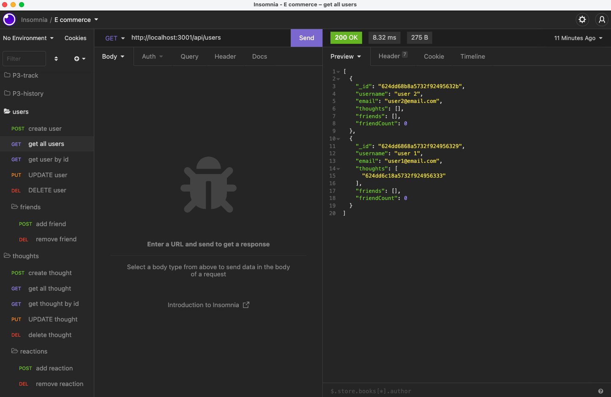

# Module 18 Challenge 
## NoSQL: Social Network API

## Table of Contents

- [Description](#description)
- [Technology](#Technology)
- [Installation](#installation)
- [Usage](#usage)
- [License](#license)
- [Contribution](#contribution)
- [Questions](#questions)

## Description:

The project is to build an API for a social network web application where users can share their thoughts, react to friends’ thoughts, and create a friend list. You’ll use Express.js for routing, a MongoDB database, and the Mongoose ODM. In addition to using the Express.jsLinks to an external site. and MongooseLinks to an external site. packages, you may also optionally use a JavaScript date library of your choice or the native JavaScript Date object to format timestamps.

## Technology:

Project is created with:

- Node.js
- Express.js
- MongoDB
- Mongoose

## Installation

To run this project, install it locally using npm:

```
npm install
```

## Usage

After installing npm packages, the application will be invoked by using the following command:

```
npm start
```


#### Insomnia Screenshot



## License

[](https://opensource.org/licenses/MIT) <br>
This project is licensed under MIT, for more information please visit [this website](https://opensource.org/licenses/MIT)

## Contribution

Made by Ngandala Lopes

## Questions?

Please feel free to contact me if you need any further information:

- [Email](mailto:ngandalalopes@gmail.com)
- [Github Profile](https://github.com/NgandalaLopes)
